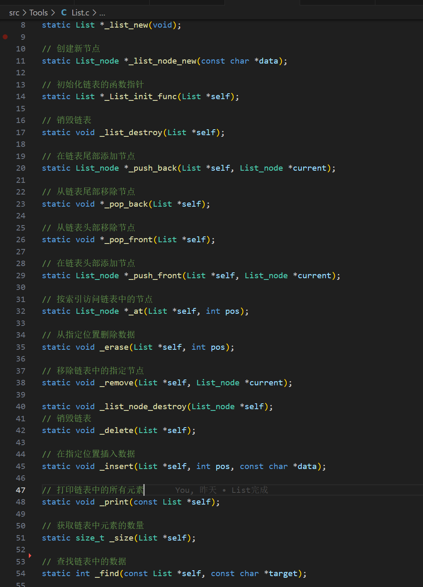
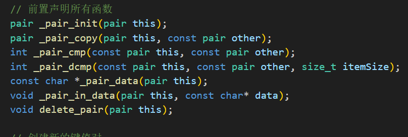
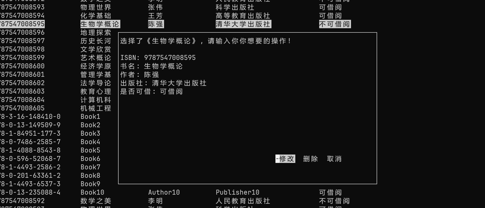
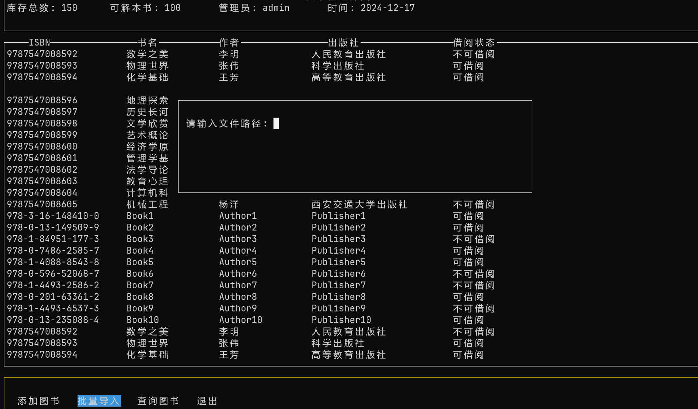
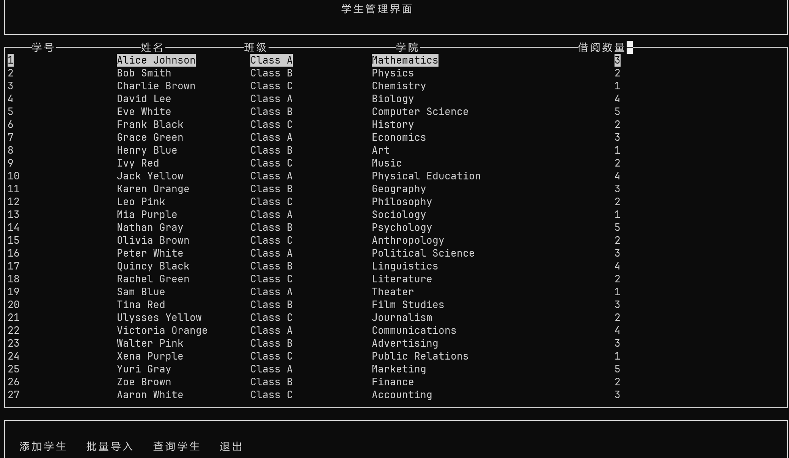
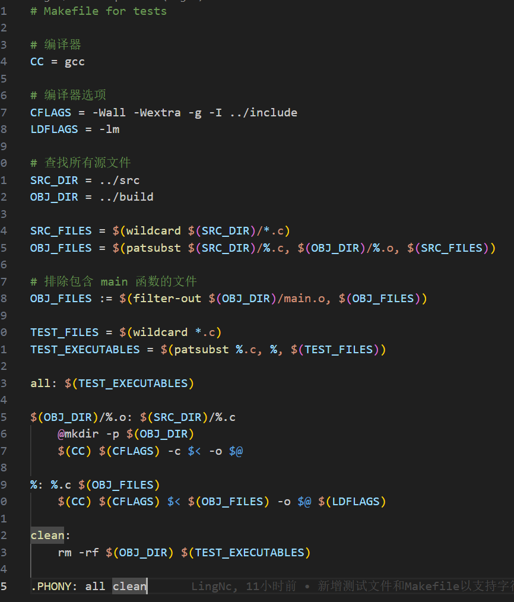

## **项目结构**

```
project-root/
├── include
│   ├── DataBase
│   │   ├── DataBase.h
│   │   └── Index.h
│   ├── Tools
│   │   ├── List.h
│   │   ├── Pair.h
│   │   ├── String.h
│   │   ├── Type.h
│   │   └── Vector.h
│   └── UI
│       ├── list.h
│       ├── menu.h
│       ├── screen.h
│       ├── utils.h
│       └── window.h
│	├── Book.h
│	├── Student.h
│	├── function.h
│	├── uiBook.h
│	└── uistudent.h
├── src
│   ├── DataBase.c
│   ├── Index.c
│   ├── Tools
│   │   ├── List.c
│   │   ├── Pair.c
│   │   ├── String.c
│   │   ├── Type.c
│   │   └── Vector.c
│   ├── UI
│       ├── list.c
│       ├── Makefile
│       ├── menu.c
│       ├── screen.c
│       ├── utils.c
│       └── window.c
│	├── Book.c
│	├── function.c
│	├── main.c
│	├── Student.c
│	├── uiBook.c
│	└── uiStudent.c
├── test
│   ├── Makefile
│   ├── test_string.c
│   └── test_vector.c
└── .gitignore
```

## 运行环境

### 1.**Linux**（Ubuntu24.04）

### 2.ncurses（UI实现由C语言的库）

### 3.gcc

#### 4.第三方库（check.h）

---

## **模块划分**

### 1. **主程序模块**
- **文件**: `main.c`
- **职责**: 程序入口，负责初始化系统、处理用户输入和调用其他模块的功能。

### 2. **数据模型模块（POJO层）**
- **文件**:
  - `book.h` 和 `book.c`
  - `student.h` 和 `student.c`
- **职责**: 定义数据结构和操作数据的函数。

### 3. **数据库模块（DAO层）**
- **文件**: `database.h` 和 `database.c`

- **职责**: 提供与文件或数据库交互的函数，负责数据的持久化。

```
├── DataBase
│   ├── DataBase.h
│   └── Index.h
```


```
├── DataBase.c
```


### 4. **工具模块（tools层）**
- **文件**: `tools.h` 和 `tools.c`
- **职责**: 提供通用的工具函数，如字符串处理、时间处理等。

```
├── Tools
│   ├── List.h
│   ├── Pair.h
│   ├── String.h
│   ├── Type.h
│   └── Vector.h
```


```
├── Tools
│   ├── List.c
│   ├── Pair.c
│   ├── String.c
│   ├── Type.c
│   └── Vector.c
```

### 5. **配置文件**
- **文件**: `config.h`
- **职责**: 定义常量和配置项。

### 6. **数据文件**
- **目录**: `data`
- **职责**: 存储持久化数据。

### 7. **测试模块**
- **目录**: `test`
- **职责**: 包含单元测试代码。

### 8. **构建工具**
- **文件**: `Makefile`
- **职责**: 定义编译规则，简化构建过程。


---

## **功能实现**

### 1. **主程序模块**
- **文件**: `main.c`
- **功能**:
  - 初始化系统。
  - 显示菜单并处理用户输入。
  - 调用其他模块的功能。

### 2. **数据模型模块**

#### 2.1 书籍管理
- **文件**: `book.h` 和 `book.c`
- **功能**:
  - 定义`Book`结构体。
  - 实现书籍的增删改查功能。
  
  

#### 2.2 学生管理
- **文件**: `student.h` 和 `student.c`
- **功能**:
  - 定义`Student`结构体。
  - 实现学生的增删改查功能。
  
  

### 3. **数据库模块**
- **文件**: `database.h` 和 `database.c`
- **功能**:
  - 提供文件读写接口。
  - 实现数据的持久化。

### 4. **工具模块**
- **文件**: `tools.h` 和 `tools.c`
- **功能**:
  - 用C语言实现了C++中vector， string与 list的绝大部分功能与实现 **键->值**pair的基本功能。
  - 实现代码的**封装，泛型**

#### vector功能


#### string功能


#### list功能



#### pair功能




### 5. **命令行界面（UI）**

- **文件**: `main.c`
- **功能**:
  - 实现菜单显示和用户输入处理。

#### 开始页面


#### 一个图书馆管理系统的界面，显示了库存总数、可借阅书籍数量、管理员信息和时间。列表中包含了书籍的ISBN、书名、作者、出版社和借阅状态。用户可以选择添加图书、批量导入、查询图书或退出系统。


#### 显示了图书馆系统中某一本书的详细信息，包括ISBN、书名、作者、出版社和借阅状态。用户可以选择对这本书进行修改、删除或取消操作。



##### 显示了图书馆系统中的书籍列表，用户可以输入ISBN号来查询书籍的详细信息。每本书的信息包括ISBN、书名、作者、出版社和借阅状态。


#### 显示了图书馆管理系统的界面，包含库存总数、可借阅书籍数量、管理员信息和时间。列表中包含了书籍的ISBN、书名、作者、出版社和借阅状态。用户可以选择添加图书、批量导入、查询图书或退出系统。



#### 显示了学生的学号、姓名、班级、学院和借阅数量。用户可以选择添加学生、批量导入、查询学生或退出系统。



---

## **测试计划**

### 1. **单元测试**
- **文件**: `test/test_check.c`, `test/test_string.c`, `test/test_vector.c`
- **功能**:
  - 测试书籍、学生和借书记录的增删改查功能。
  - 测试string和vector的正确性。

---

## **部署和运行**

它会先为include那个文件里边儿所有文件生成链接文件，然后再对每一个源文件进行编译，编译成可连接文件。然后再将所有的链接文件按照一定的顺序，将多文件的编译全放在一起，同时链接。




---

## **总结**

通过以上项目安排，可以实现一个功能完善、结构清晰的图书馆管理系统。需要造的轮子包括vector,List,string,pair。文件操作封装、字符串处理、时间处理、UI界面、错误处理、内存管理和测试框架。